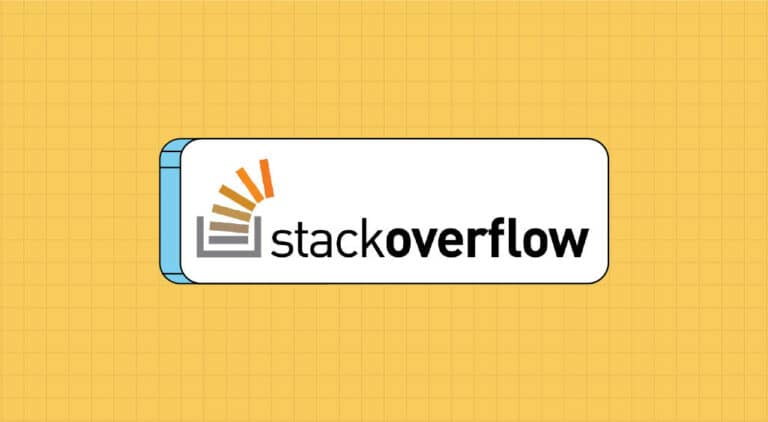

# ⚡🔎📈S̳t̳a̳c̳k̳ ̳O̳v̳e̳r̳f̳l̳o̳w̳ ̳T̳r̳e̳n̳d̳s̳ ̳A̳n̳a̳l̳y̳s̳i̳s̳📊💥📉

## Overview 🔍
This project analyzes the trends and popularity of various programming languages on Stack Overflow from 2008 to 2024, exploring the impact of AI tools like ChatGPT on developer query behavior.

## Dataset 🗂️

The dataset contains the following columns:
- `Month`: The month & year in which the data was recorded.
- `C++`, `C#`, `TypeScript`, `PHP`, `Swift`, `Ruby`, `Go`, `SQL`, `Kotlin`, `Scala`, `Shell`, `C`, `HTML`, `Objective-C`, `Perl`, `Matlab`, `R`, `Python`, `Java`, `JavaScript`: The total number of questions asked on Stack Overflow related to the specific programming language during the given month.
The dataset used for this analysis can be found on Kaggle [here](https://www.kaggle.com/datasets/computingvictor/monthly-trends-in-stack-overflow-questions).

## Tools Used 🛠️

  
  
  
  
  
  
  
  

- **Pandas:** Data manipulation and analysis.
- **Seaborn:** Statistical data visualization.
- **Matplotlib:** Plotting library for Python.
- **SciPy:** Scientific computing and technical computing.
- **NumPy:** Numerical computing with Python.
  
## Findings✨🕵

### Overall Trends 📈
- There is a noticeable decrease in the number of questions asked from 2022 to 2024, potentially due to the adoption of AI tools like ChatGPT.
- The average number of questions asked before mid-2020 was higher compared to after mid-2020.
- A t-test resulted in a t-statistic of 2.873 and a p-value of 0.0045, indicating that the decrease is statistically significant.

### Total Questions per Programming Language 🤔
- Python and JavaScript have the highest number of questions overall, indicating their widespread use and popularity.
- Languages like Perl and Objective-C have fewer questions, suggesting a decline in their usage.

### Monthly Trends 🗓️
- Monthly analysis shows seasonal variations in the number of questions asked, with certain months seeing higher activity than others.

### Individual Language Trends 🔥
- Some languages, such as Python and JavaScript, have shown a consistent increase in the number of questions asked over the years.
- Other languages, such as PHP and Ruby, have shown a decline in the number of questions over time.
- The period from 2022 to 2024 shows a noticeable decrease in questions across most languages, potentially indicating the impact of AI tools like ChatGPT.

## 👩‍💻 Author

- GitHub: [@rania3103](https://github.com/rania3103)
- LinkedIn: [LinkedIn](https://linkedin.com/in/rania-abassi-24105a249)
